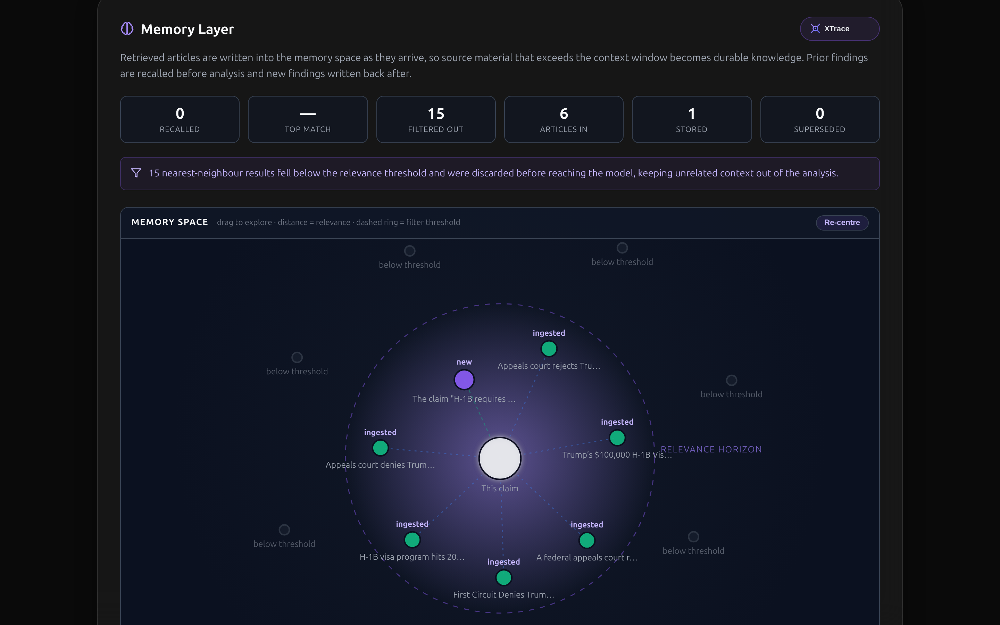
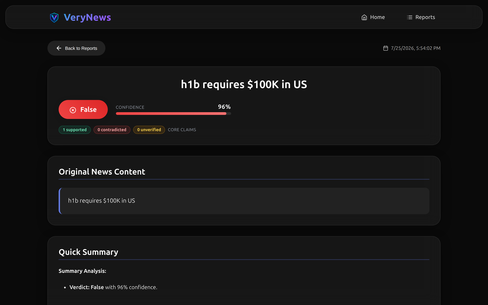
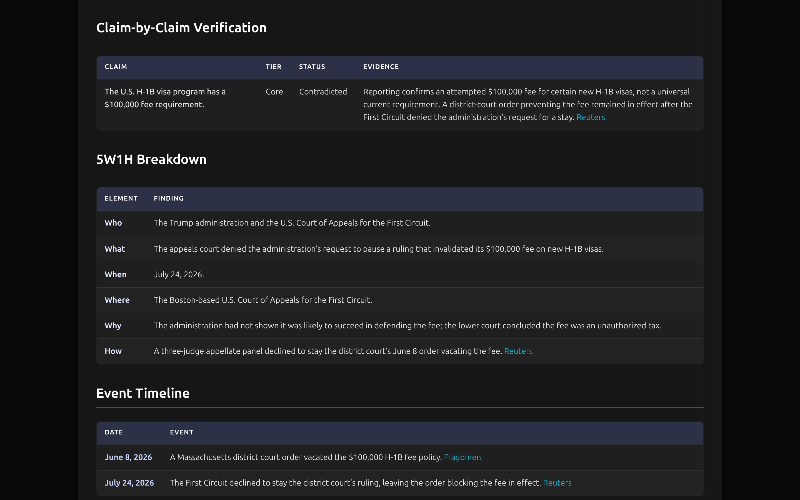
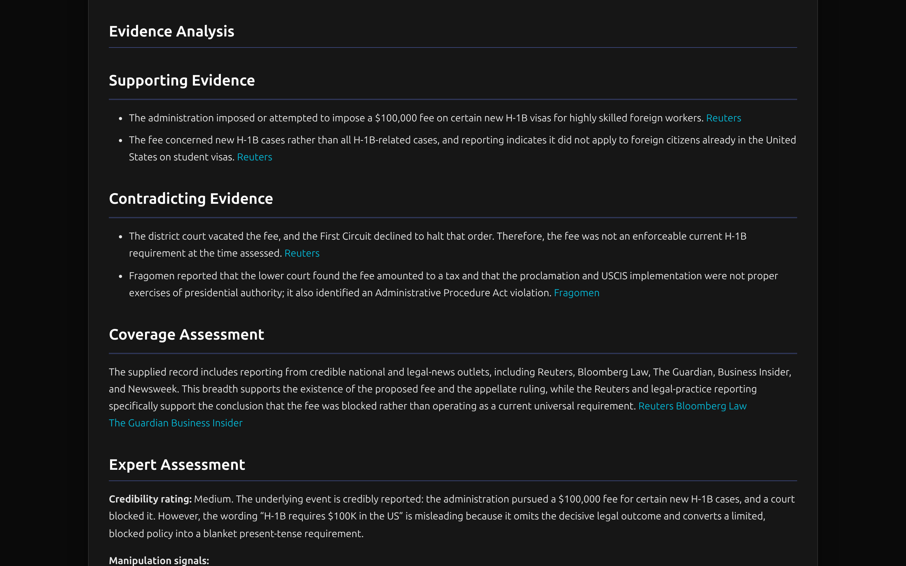
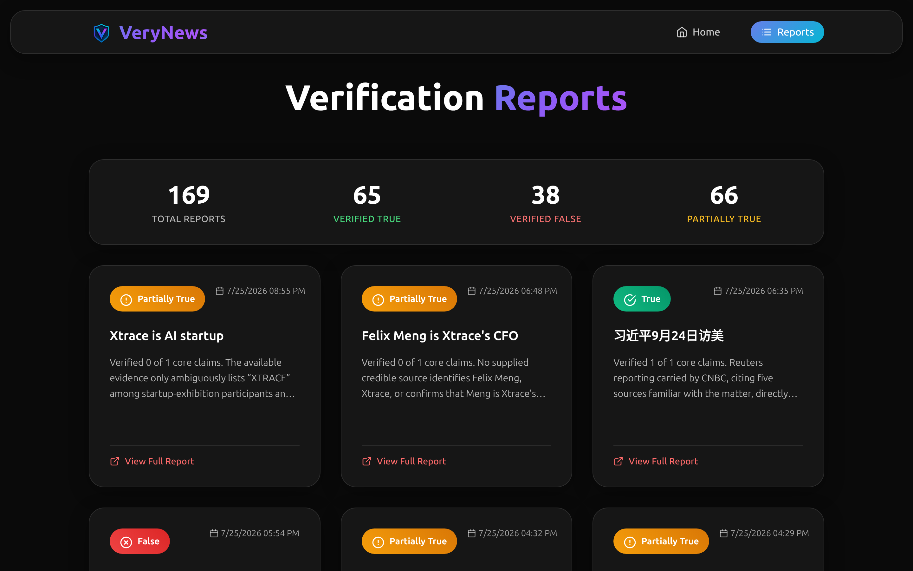

<div align="center">


# Memory Is All You Need

### VeryNews × **XTrace** — fact-checking that never verifies the same thing twice

<br />


<a href="https://verynews.org"></a>


<br /><br />

<h3><i>An agent that forgets is an agent that lies confidently.</i></h3>

<br />


</div>

---

<div align="center">

## The problem nobody solves by adding more context

</div>

A fact-checking run reads **far more retrieved text than fits in a context window**, and
the model has **no recollection of anything it verified before**.

Both failures produce the same output: *confident claims that aren't grounded in evidence.*

You cannot fix this with a bigger window. A bigger window still forgets everything the
moment the run ends. Every claim gets re-verified from scratch. Everything the system
proved last week is gone.

<div align="center">

### **The missing primitive isn't context. It's memory.**

</div>

---

<div align="center">

## Enter XTrace


</div>

[**XTrace**](https://docs.xtrace.ai) is hosted long-term memory for AI agents. Send it
conversation turns; it extracts structured memories, embeds them, and hands them back when
they matter.

VeryNews uses it to turn every verification into **permanent, retrievable knowledge**:

```
      RUN 1                    RUN 2                    RUN 3
        │                        │                        │
  ┌─────┴─────┐            ┌─────┴─────┐            ┌─────┴─────┐
  │  verify   │            │  recall   │            │  recall   │
  │   from    │  ────────► │     +     │  ────────► │     +     │
  │   zero    │            │  verify   │            │  verify   │
  └─────┬─────┘            └─────┬─────┘            └─────┬─────┘
        │                        │                        │
        └──────► XTrace ───────┴──────► XTrace ───────┘
                 remembers               compounds
```

The system doesn't just get *faster*. It gets **harder to fool** — because it remembers
which sources lied to it last time.

<div align="center">

</div>

<div align="center">
<sub><i>Every run shows exactly what memory did — recalled, filtered, stored, superseded.<br />
The plot is live: distance from centre is relevance, the dashed ring is the cutoff.</i></sub>
</div>

---

## How verification works

VeryNews never asks a model *"is this true?"*. It runs a pipeline:

1. **Decompose** the claim into individually checkable statements
2. **Recall** what XTrace already established about it
3. **Retrieve** fresh evidence from trusted sources
4. **Adjudicate** each statement separately — supported, contradicted, unverified
5. **Remember** the outcome, so run *n+1* starts where run *n* ended

The verdict is *derived* from the per-claim results, so the headline can never disagree
with the evidence table beneath it.

<div align="center">

</div>

---

<div align="center">

## The XTrace Agent Loop

</div>

Four integration points. Each maps to a stage of the loop.

| Stage | What VeryNews does with it |
| --- | --- |
| 🔍 **Recall before acting** | Looks for prior findings on the same claim. A strong match counts as a prior verdict; a weak one is background context. |
| 🧠 **Act with context** | Pulls accumulated lessons about source reliability through the pre-tool-call `trigger` hook — which fires on symbol tripwires, not vectors, and is **quota-free**. |
| 💾 **Save what changed** | Persists the verdict, the per-claim evidence and the report. |
| 📈 **Compound over time** | Writes retrieved articles into the memory space, so source material that overflowed the context window becomes durable knowledge. |

### Two guards against hallucinated context

Vector search **always** returns its nearest neighbours — however far away they are.
Injecting an unrelated memory adds exactly the kind of unsupported context that causes
hallucination. So recalled rows are filtered twice before they reach a prompt:

- **A relevance floor** discards weak matches outright. In early testing, a Kenya
  geothermal claim recalled an unrelated Artemis II fact — that class of noise works
  directly against the point of adding memory.
- **A lexical overlap check** requires survivors to share discriminating words with the
  claim, so semantically adjacent but factually unrelated rows never reach the model.

Recalled memories enter the prompt **with their scores visible**, under an explicit
instruction: treat these as corroboration to cross-check, *never* as freshly retrieved
evidence. Where they conflict with today's sources, prefer today's sources and say so.

> A claim whose only backing is a recalled memory gets **demoted**. Memory can corroborate.
> It cannot be the sole basis for a verdict.

---

<div align="center">

## The integration, in full

</div>

No official Python SDK exists, so [`xtrace_memory.py`](xtrace_memory.py) is a small HTTP
client — **four calls, one per stage of the loop.**

```python
from xtrace_memory import XTraceMemory, render_context

memory = XTraceMemory()          # reads XTRACE from the environment

# 1. Recall before acting
prior = memory.recall("h1b requires $100K in US")
# [{'text': 'The claim "H-1B requires $100K in the US" is false.',
#   'type': 'fact', 'score': 0.75}, ...]

# 2. Act with context — inject prior findings into the judgement prompt
context = render_context(prior)

# 3. Save what changed
memory.remember(claim, verdict="False", reason="...")
# {'stored': True, 'created': 2, 'superseded': 0}

# 4. Observe what accumulated
memory.usage()
# {'memories_active': 67, 'messages_ingested': 299, 'searches': 44}
```

<sub>*Output above is real, from a live run against the production API.*</sub>

### What each call maps to

| Call | Endpoint | Notes |
| --- | --- | --- |
| `recall()` | `POST /v1/memories/search` | Vector search over prior findings. Uses `mode="retrieve"` — `compose` would spend an extra server-side LLM round-trip to assemble a prompt block, which is rendered locally instead. |
| `lessons()` | `POST /v1/memories/trigger` | Procedural recall via the pre-tool-call hook. Fires on symbol tripwires rather than vector similarity, and is **exempt from the monthly quota** — cheap enough to call on every run. |
| `remember()` | `POST /v1/memories` | Writes the verdict as a user/assistant exchange, so extraction sees the claim and its adjudication together. `wait=true` keeps a demo synchronous. |
| `usage()` | `GET /v1/usage` | Period totals — compounding becomes measurable rather than asserted. |

### Memory types this produces

| Type | In VeryNews |
| --- | --- |
| `fact` | An established statement — "the claim X is false" |
| `episode` | A session-level summary of one verification run |
| `lesson` / `procedure` | Accumulated guidance about sources and retrieval strategy, scoped to a `namespace` |

When a new run contradicts an existing fact, XTrace **supersedes** the old one and reports
the mapping in `memories_superseded_by`. That is what keeps the store correct as a story
develops rather than merely growing.

> `xtrace_memory.py` here is a **reference implementation** — intentionally minimal, so the
> integration is legible. Production deployments add relevance filtering, cost controls and
> retry policy on top.

---

<div align="center">

## Evidence you can see

</div>

Every verdict shows the quote and the source behind it. Claims are tiered (core vs
peripheral), each carrying its own status and citation.

<div align="center">

</div>

The 5W1H breakdown and event timeline are grounded the same way — where a fact could not
be established, the report **says so** rather than filling the gap.

<div align="center">

</div>

---

<div align="center">

## 169 verifications and counting

<sub><i>Every one of them now lives in XTrace.</i></sub>



</div>

---

<div align="center">

## Quick start

</div>

```bash
git clone https://github.com/GY19A/VeryNews-Agent.git
cd VeryNews-Agent
pip install -r requirements.txt

cp .env.example .env    # then fill in your keys
```

```python
from verynews_news_agent import verynews_news_judge

result = verynews_news_judge("h1b requires $100K in US")

print(result["judge_json"]["result"])   # False
print(result["markdown_report"])        # full report
print(result["memory"])                 # what memory did this run
```

Without an `XTRACE` key the memory layer disables itself and the pipeline runs unchanged.

### Configuration

| Variable | Required | Notes |
| --- | --- | --- |
| `GOOGLE_API_KEY` | yes | Gemini API key |
| `MODEL` | yes | e.g. `gemini-2.0-flash` |
| `SITES_TRUSTED_SOURCE` | yes | Trusted outlets to search against |
| `XTRACE` | no | XTrace API key from [app.xtrace.ai](https://app.xtrace.ai). Omit to run without memory. |

> **Never commit `.env`.** Use `.env.example` as the template.

---

<div align="center">

## Design principles

</div>

**Memory must never break a verification.** The memory layer degrades to a neutral value
on failure. If it is unreachable, unconfigured or rate-limited, the pipeline runs exactly
as it would without it — memory *enriches* a verification; it can never be the reason one
fails.

**Ingestion is the metered operation**, so it is bounded: already-seen sources are skipped,
only the highest-ranked articles are sent, and each is condensed rather than stored whole.

**Recalled memory is evidence about the past, not the present.** It corroborates. It never
substitutes.

---

<div align="center">

## Architecture

</div>

```
claim
  │
  ├─ recall prior findings ──────┐   vector search, double-filtered
  ├─ recall learned guidance ────┤   trigger hook
  │                              ▼
  ├─ translate → 5W1H → search → evidence → expert → timeliness
  │                              │
  │                              ├─ ingest articles      overflow → memory
  │                              ▼
  ├─ judgement  ◄──── recalled context injected here
  ├─ visualization
  ├─ report
  │
  └─ persist verdict ────────────►  verdict + evidence + report
```

| File | Role |
| --- | --- |
| `verynews_news_agent.py` | Agent pipeline and orchestration |
| `xtrace_memory.py` | Memory client — recall, trigger, persist, usage |
| `prompts.py` | Prompt templates for every agent |
| `utils.py` | Search and source formatting |
| `index.html` | Single-file front end, no build step |

---

<div align="center">


### Memory Is All You Need

**[verynews.org](https://verynews.org)** · Truth in Every News

<sub>Long-term memory by <a href="https://docs.xtrace.ai"><b>XTrace</b></a></sub>

</div>
